# CLASSIFICATION TASK

Classification in machine learning is a type of supervised learning approach where the goal is to predict the category or class of an instance that are based on its features. In classification it involves training model ona dataset that have instances or observations that are already labeled with Classes and then using that model to classify new, and unseen instances into one of the predefined categories.

## MACHINE LEARNING CLASSIFICATION ALGORITHMS

dataset used :- *cpu.arff*

## STEPS INVOLVED

NORMALISE THE DATASET 

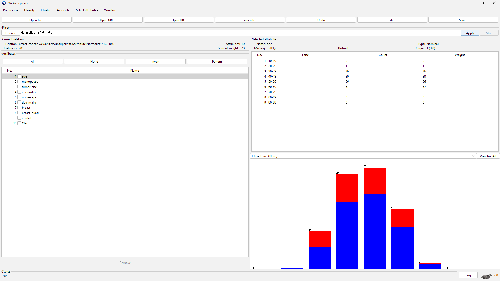

### CLASSIFIERS USED

**DecisionStump**

  A decision stump is a machine learning model consisting of a one-level decision tree.That is, it is a decision tree with one internal node (the root) which is immediately connected to the terminal nodes (its leaves). 

#### CROSS VALIDATION

##### 10 FOLDS 

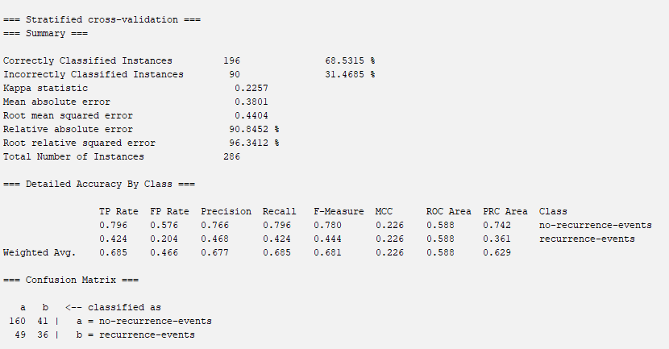
##### 5 FOLDS 

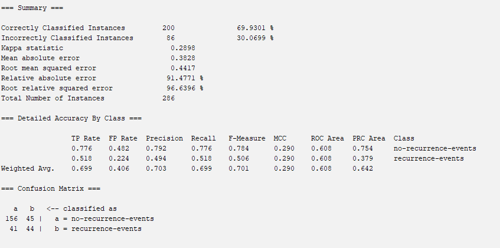

#### PERCENTAGE SPLIT

##### 80% 

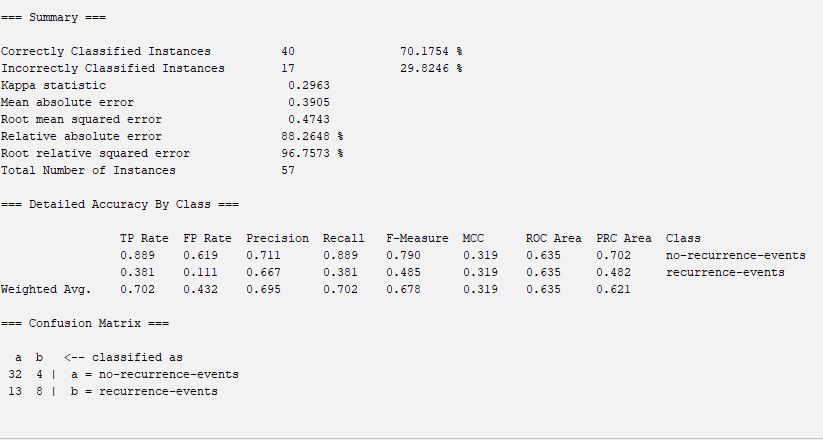

**RandomForest**

Random Forest uses numerous decision trees to increase prediction accuracy and reduce overfitting. It constructs many trees and integrates their predictions to create a reliable model. Diversity is added by using a random dataset and characteristics in each tree.

#### CROSS VALIDATION

##### 10 FOLDS 

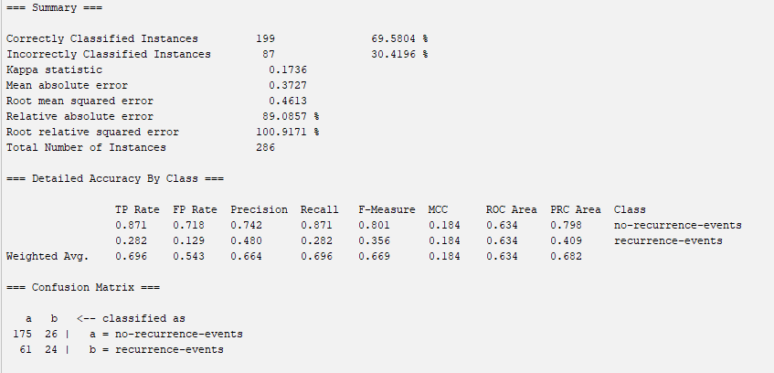

##### 5 FOLDS 

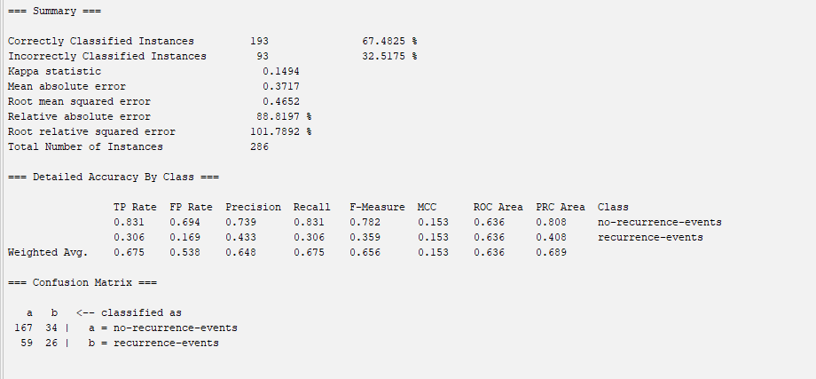

#### PERCENTAGE SPLIT

##### 80% 

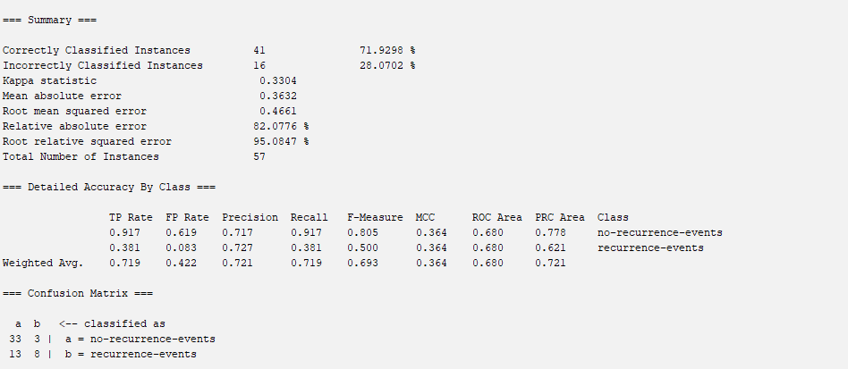

**NaiveBayes**

Naive Bayes which describes the probability of an event, based on prior knowledge of conditions that might be related to the event. Naive Bayes classifiers assume that the presence (or absence) of a particular feature of a class is unrelated to the presence (or absence) of any other feature, given the class variable

#### CROSS VALIDATION

##### 10 FOLDS 

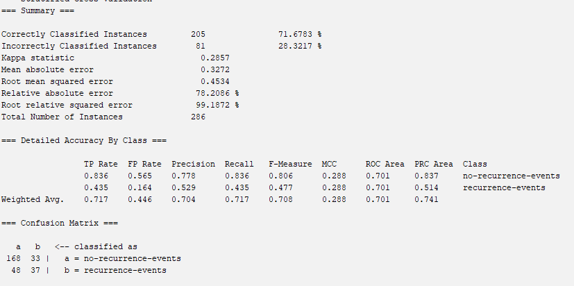

##### 5 FOLDS 

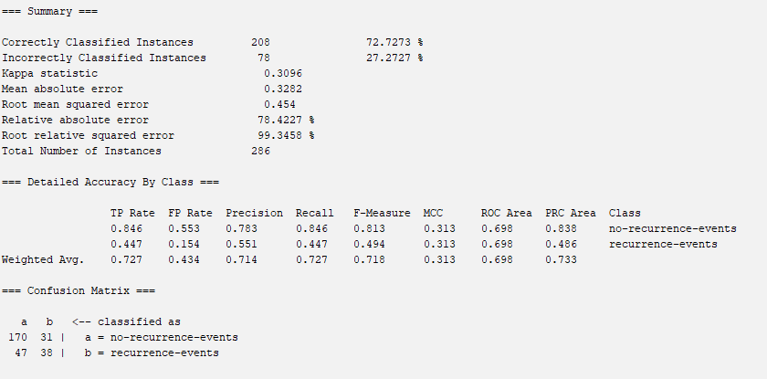

#### PERCENTAGE SPLIT

##### 80% 

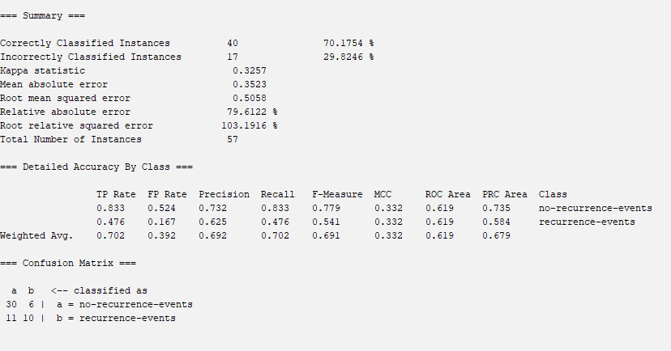

**Logistic Regression Classification**

In Logistic regression is classification algorithm used to estimate discrete values, typically binary, such as 0 and 1, yes or no. It predicts the probability of an instance belonging to a class that makes it essectial for binary classification problems like spam detection or diagnosing disease.

#### CROSS VALIDATION

##### 10 FOLDS 

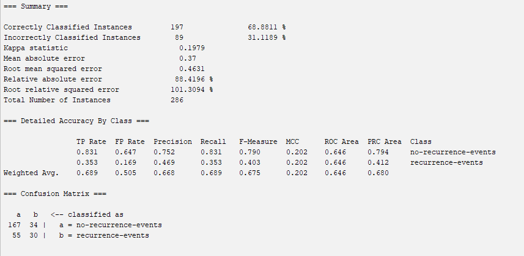

##### 5 FOLDS 

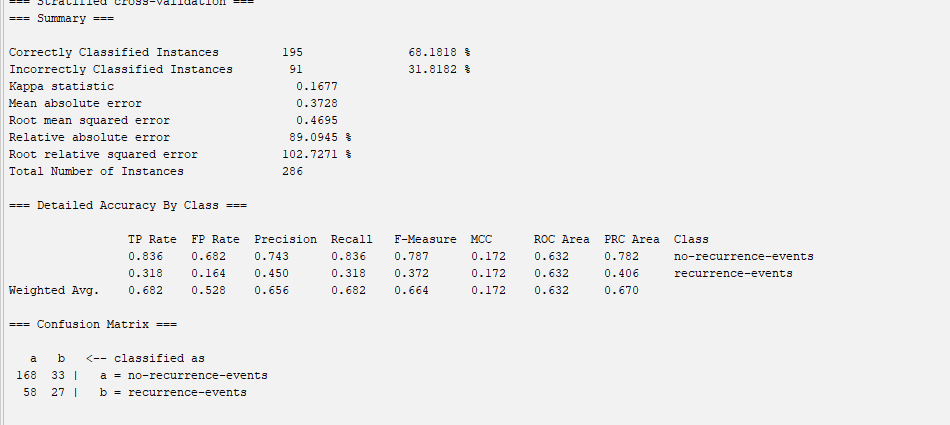

#### PERCENTAGE SPLIT

##### 80% 

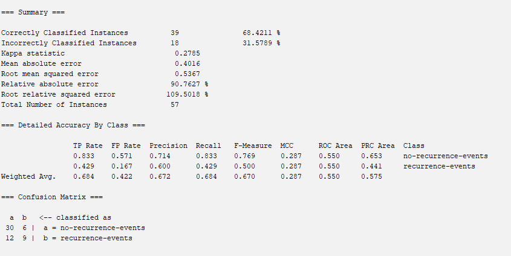

**DecisionTable**

A decision table is a brief visual representation for specifying which actions to perform depending on given conditions.

#### CROSS VALIDATION

##### 10 FOLDS 

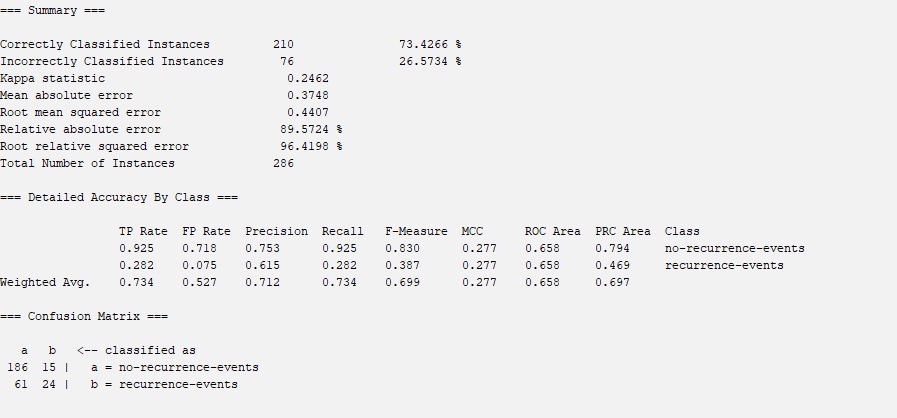

##### 5 FOLDS 

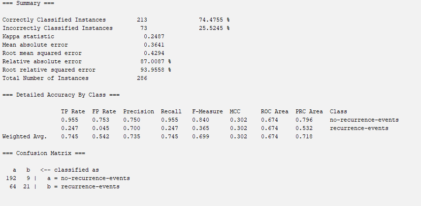

#### PERCENTAGE SPLIT

##### 80% 

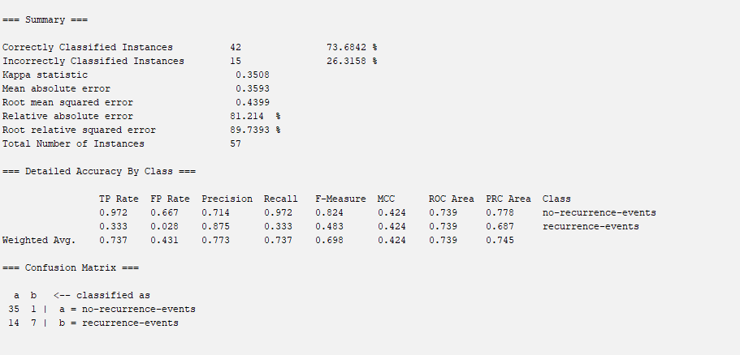

## GLOSSARY

**TP Rate:** The proportion of correctly classified positive instances out of all actual positive instances.

**FP Rate:** The proportion of incorrectly classified negative instances out of all actual negative instances.

**Precision:** The proportion of correctly classified positive instances out of all instances classified as positive.

**Recall:** The proportion of correctly classified positive instances out of all actual positive instances (also known as True Positive Rate).

**F-measure:** The harmonic mean of precision and recall, providing a balance between the two metrics.

**MCC (Matthews Correlation Coefficient):** A measure of the quality of binary classifications, considering true and false positives and negatives.

**ROC Area:** The area under the Receiver Operating Characteristic curve, representing the model's ability to distinguish between positive and negative classes.

**PRC Area:** The area under the Precision-Recall curve, highlighting the trade-off between precision and recall for different thresholds.
