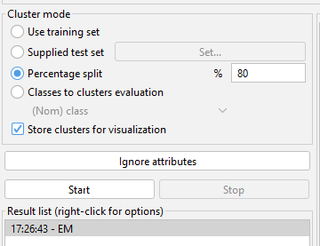
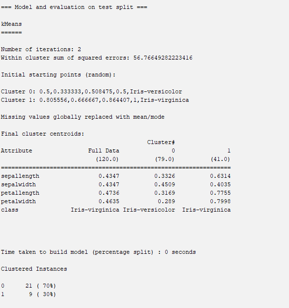
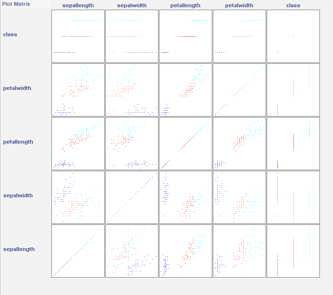

# CLUTTERING TASK

The task of grouping data points based on their similarity with each other is called Clustering or Cluster Analysis.

The various types of clustering are:

- Hierarchical clustering
- Partitioning clustering 

Hierarchical clustering is further subdivided into:

- Agglomerative clustering
- Divisive clustering

Partitioning clustering is further subdivided into:

- K-Means clustering 
- Fuzzy C-Means clustering

W
There is no labeled data for this clustering, unlike in supervised learning. K-Means performs the division of objects into clusters that share similarities and are dissimilar to the objects belonging to another cluster.

## STEPS INVOLVED

dataset used :- *iris.arff*

- NORMALISE THE DATASET 

- Go to cluster menu and use percentage split **80%**

**CLUSTER METHOD**

## VISUALISATION

--- 
